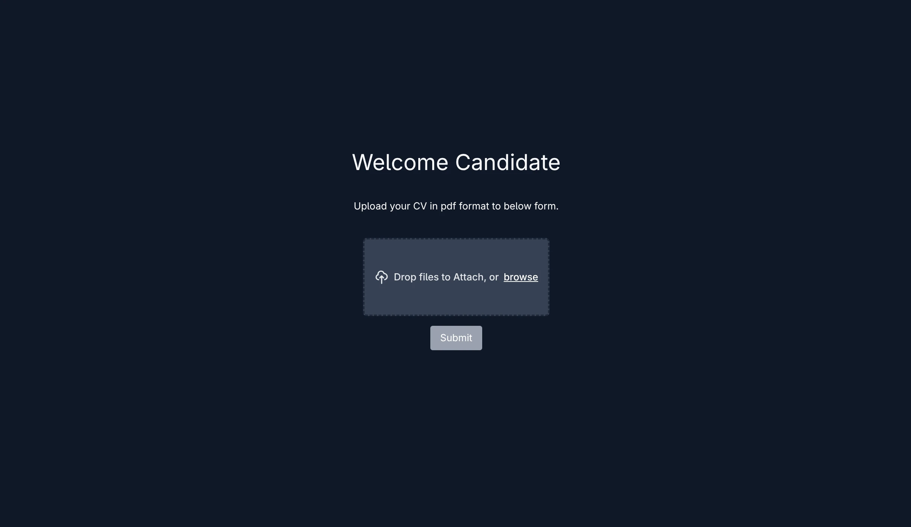

<div align="center">

# CV submission automater
-- An Open Source Automated CV Processing Pipeline --

</div>

## Why I made this?
Many startup companies don't have time to implement their own custom pipeline for smooth recruiting workflow that can satisfy both them and the recruiter.

This aims to solve that by providing a FOSS boilerplate that can easily implemented on their infrastucture. This is made specially keeping cost efficiency in mind.

## Preview


## What this does
1. Collects candidates' CVs from an intuitive frontend.
2. Extracts relevant details (via RegEx).
3. Appends data to a recruiter’s Google Sheet.
4. Notifies the recruiter once processing is complete.
5. Sends follow-up emails to candidates.

## TODO
- [ ] Sending follow up emails in candidates' convenient timezone defined by the recruiters.
- [ ] Adding a method to keep track on the CV progress and send mails to candidates when there is an update. 
- [ ] Adding AI based CV details extraction as an option for the recruiters.
- [ ] Implement an MCP (Model-Context-Protocol) to bridge the result spreadsheet with an AI chatbot, so the recruiters can query the candidates CVs using human language instead of manually searching through the spreadsheet.


## Technologies used
1. **Frontend** - React (bootsrapped with vite)
2. **Backend** - Python (Lambda function)
3. **Middleman** - Python (Lambda function)
4. **Infrastructure**  - Amazon Web Services (AWS)
5. **Email Service** - SendGrid, AWS SES
6. **Google sheets api** - To write to google sheets
7. **CI/CD** - AWS Codepipeline and Codebuild
8. **Infra-management** - Terraform
9. **VCS** - Git and GitHub
10. **Testing** - Pytest

## Deployment Instructions
#### Prerequisites

1. AWS IAM user with following permissions

```
AmazonAPIGatewayAdministrator
AmazonS3FullAccess
AmazonSSMFullAccess
AWSCodeBuildAdminAccess
AWSCodePipeline_FullAccess
AWSLambda_FullAccess
CloudWatchLogsFullAccess
IAMFullAccess
CodeStarAccessCustom (refer the custom policy)
KMSAccessCustom (refer the custom policy)
```

##### Codestar custom inline policy
```
{
	"Version": "2012-10-17",
	"Statement": [
		{
			"Sid": "ConnectionsFullAccess",
			"Effect": "Allow",
			"Action": [
				"codeconnections:CreateConnection",
				"codeconnections:DeleteConnection",
				"codeconnections:UseConnection",
				"codeconnections:GetConnection",
				"codeconnections:ListConnections",
				"codeconnections:ListInstallationTargets",
				"codeconnections:GetInstallationUrl",
				"codeconnections:StartOAuthHandshake",
				"codeconnections:UpdateConnectionInstallation",
				"codeconnections:GetIndividualAccessToken",
				"codeconnections:TagResource",
				"codeconnections:ListTagsForResource",
				"codeconnections:UntagResource"
			],
			"Resource": "*"
		}
	]
}
```

##### KMS custom inline policy
```
{
	"Version": "2012-10-17",
	"Statement": [
		{
			"Effect": "Allow",
			"Action": [
				"kms:Encrypt",
				"kms:Decrypt",
				"kms:GenerateDataKey*",
				"kms:DescribeKey",
				"kms:CreateKey",
				"kms:ListKeys",
				"kms:CreateAlias"
			],
			"Resource": "*"
		}
	]
}
```

#### Steps

1. Fork, clone and cd into the repo:
```bash
git clone "your-fork's-git-url"
cd <your-fork's-name>
```

2. zip backend and middleman codes:
```bash
cd backend
mkdir package
uv pip install --target=package -r requirements.txt
cp -r lambda_function.py models/ utils/ package/
cd package
zip -r ..//lambda_function.zip && cd ../..

cd middleman 
mkdir package
uv pip install --target=package -r requirements.txt
cp -r get_presigned_url.py models/ utils/ package/
cd package
zip -r ..//lambda_get_presigned_url.zip && cd ..
```

2. Go to terraform dir and create the variables.tfvars file as follows:

```bash
cd ..
cd terraform
```

```txt
# terraform.tfvars
aws_region           = "preffered-region"
github_owner         = "github-user-name-of-the-git-repo"
github_repo          = "fork's-name"
github_token         = "gh-PAT-token"
github_webhook_secret = "put-a-unique-password-here"
```

2. Init terraform:

```bash
terraform init
```
4. Deploy the infra:
```bash
terraform validate
terraform plan --out="tfplan"
terraform apply "tfplan"
```

4. Go to AWS Codepipeline console > settings > connections and verify the codestar connection.

5. Push the code to online git repo:
```bash
git push -u origin main
```

## License
This is licensed under MIT license.
